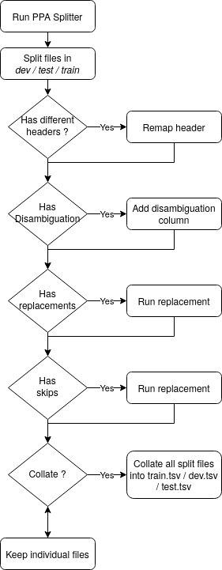

Protogoneia
====================

[](https://coveralls.io/github/hipster-philology/protogeneia?branch=master)
[](https://travis-ci.org/hipster-philology/protogeneia)
[](https://pypi.org/project/protogeneia)

## Install from release

```bash
pip install protogeneia
```

## Install unstable

```bash
pip install --upgrade https://github.com/hipster-philology/protogeneia/archive/master.zip
```

## Install from source

Start by cloning the repository, and moving inside the created folder

```bash
git clone https://github.com/hipster-philology/protogeneia.git
cd ppa-splitter/
```

Create a virtual environment, source it and run

```bash
pip install -r requirements.txt
```

## Configuration file

To configurate, you can have a look at the examples in [./tests/test_config](./tests/test_config) but more generally
you can and should use the schema: [./ppa_splitter/schema.rng](./ppa_splitter/schema.rng)

## Workflow


